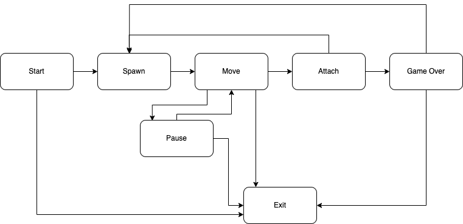

# School 21 - BrickGame - Tetris

Добро пожаловать в Tetris — одну из самых захватывающих и культовых игр серии BrickGame! Эта классическая интерпретация написана на языке C и использует консольную графику на базе библиотеки `ncurses`, чтобы сделать игровой процесс ярким и динамичным.

Логика игры построена на конечных автоматах (Finite State Machines, FSM), схему которых вы можете увидеть ниже:



---

## Управление игрой

Управляйте тетрамино и наслаждайтесь процессом с помощью простых клавиш:

- **Начать игру**: Нажмите `s`  
- **Завершить игру**: Нажмите `q`  
- **Поставить на паузу**: Нажмите `p`  
- **Двигаться влево**: Нажмите `←` (стрелка влево)  
- **Двигаться вправо**: Нажмите `→` (стрелка вправо)  
- **Ускорить падение (двойной сдвиг вниз)**: Дважды нажмите `↓` (стрелка вниз)  
- **Повернуть тетрамино**: Нажмите `Пробел`  

---

## Подсчет очков

Очищайте ряды и набирайте очки! Чем больше рядов вы уберете за раз, тем выше награда:

- **1 ряд**: `100` очков  
- **2 ряда**: `300` очков  
- **3 ряда**: `700` очков  
- **4 ряда**: `1500` очков  

---

## Уровни

Погрузитесь в нарастающий ритм игры:

- Игра начинается с **уровня 1**.  
- Каждые набранные `600` очков повышают уровень на `1`, ускоряя падение тетрамино.  
- Максимальный уровень — **10**.  

Сможете ли вы дойти до конца?

---

## Завершение игры

Игра заканчивается, когда новый тетрамино не может появиться вверху игрового поля из-за переполнения блоков. Ваш итоговый счет будет показан на экране, и если он превзойдет предыдущий рекорд, он станет новым лучшим результатом!

Удачи и приятной игры!

---

## Интерфейс библиотеки

Взаимодествие с библиотекой осуществляется с помощью функций:
```
void userInput(UserAction_t action, bool hold);

GameInfo_t updateCurrentState();
```

Передаваемые данные: 
```
typedef enum {
    Start,
    Pause,
    Terminate,
    Left,
    Right,
    Up,
    Down,
    Action
} UserAction_t;

typedef struct {
    int **field;
    int **next;
    int score;
    int high_score;
    int level;
    int speed;
    int pause;
} GameInfo_t;
```

Благодаря этому вы можете создавать любой по вашему желанию интерфейс для игры, получая данные напрямую от библиотеки.


## Сборка библиотеки

Для создания библиотеки Tetris выполните:

```bash
make s21_tetris.a
```

Чтобы собрать исполняемый файл игры:

```bash
make s21_tetris_cli
```

## Установка
Для установки игры убедитесь, что у вас установлена библиотека ncurses. Затем выполните:

```bash
make install
```

## Генерация документации
Чтобы создать документацию с помощью Doxygen, установите необходимые пакеты:  
* `graphviz` (для генерации графов)
* `doxygen` (основной инструмент)

Затем выполните команду:

```bash
make dvi
```

В результате вы получите подробную документацию проекта в папке docs.

Спасибо за внимание!
